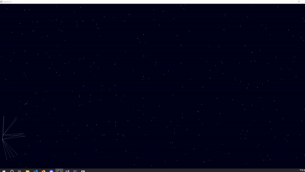

<div align="center">

# Ball Animation with SFML

[](https://www.sfml-dev.org/)


</div>

## Introduction

Welcome to the Ball Animation! 🎉 Dive into a mesmerizing display of animated balls zipping across the screen, leaving colorful trails in their wake. 

Watch as these playful spheres bounce around, creating intricate patterns and dazzling trails. Customize colors, tweak ball speeds, and adjust trail effects to make the animation truly your own!
## Demo



## Usage

### Prerequisites

- [SFML](https://www.sfml-dev.org/download.php) library installed.
- A C++ compiler that supports C++11 or later.

### Building the Project

1. **Clone the repository:**
   ```bash
   git clone https://github.com/iach526526/SFML-ball.git
   cd SFML-ball
   ```

2. **Compile the code:**
   Use your preferred build system (e.g., CMake, Makefile) to compile the project. Ensure SFML is properly linked.

### Running the Program

After building the project, execute the compiled binary to start the animation. The program will display a window with animated balls and trails.

## Customization

You can customize various aspects of the animation by modifying the `#define` settings in the source code.

### Configuration Options

- **Window Size:**
  ```cpp
  #define width 1920
  #define height 1080
  ```

- **Ball Properties:**
  - **Color:**
    ```cpp
    #define ballColor sf::Color(154, 201, 60, 255)
    ```
  - **Size:**
    ```cpp
    #define ballSize 1.f
    ```

- **Trail Properties:**
  - **Enable Trails (1 to enable, 0 to disable):**
    ```cpp
    #define enable_trail 1
    ```
  - **Color:**
    ```cpp
    #define trailColor sf::Color(128, 0, 128, 128)
    ```
  - **Maximum Trail Length:**
    ```cpp
    #define MAX_TRAIL_LENGTH 50
    ```

- **Ball Speed:**
  ```cpp
  #define ballSpeed 0.5f
  ```

- **Number of Balls:**
  ```cpp
  #define ballCount 300
  ```

## How It Works

- **`dot_dot` Class:** Manages individual ball properties, including position, movement, and drawing.
- **`LinkDrawer` Class:** Handles drawing lines between balls based on their distance and transparency settings.

## Example

To adjust the color of the balls and the trail, change the `ballColor` and `trailColor` values. For example, to set the ball color to red and disable the trail:

```cpp
#define ballColor sf::Color(255, 0, 0, 255) // Red color
#define enable_trail 0 // Disable trails
```

## License

This project is licensed under the Apache License. See the [LICENSE](./LICENSE) file for details.
